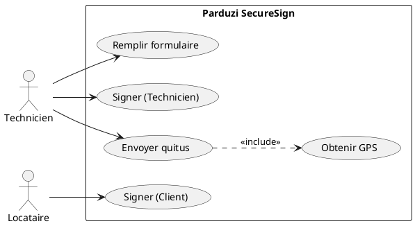
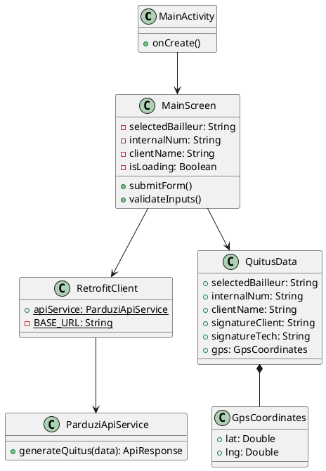
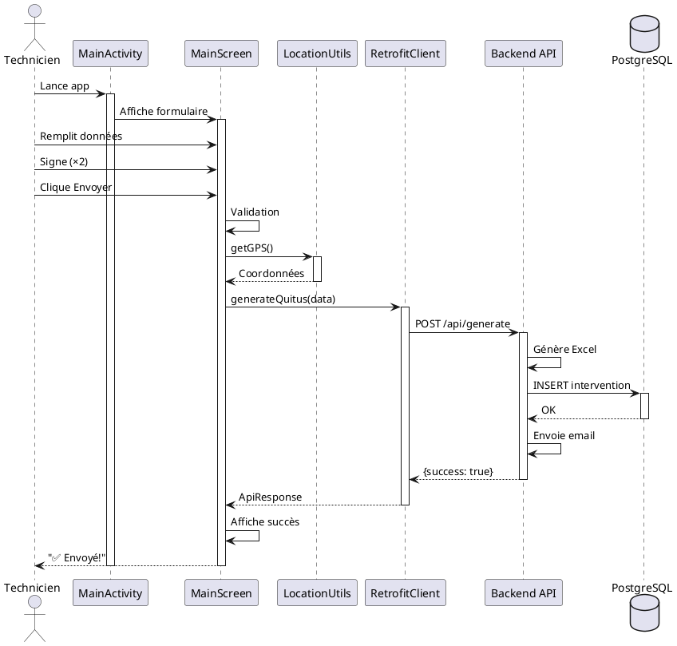
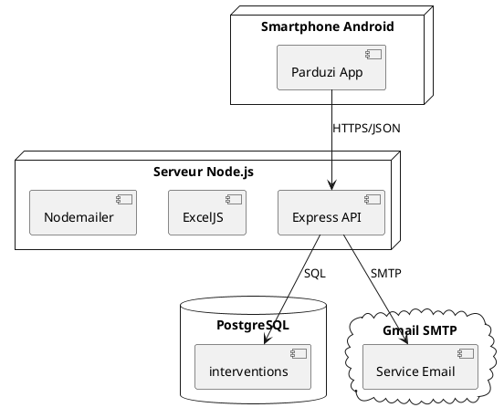

# 📁 LIVRABLES POUR VALIDATION TITRE CDA
## Dossier Professionnel - Concepteur Développeur d'Applications

**Candidat:** [Votre nom]  
**Session:** 2026  
**Projet:** Parduzi SecureSign - Application Android

---

## 📋 LISTE DES DOCUMENTS À FOURNIR

### 1️⃣ DOSSIER PROFESSIONNEL (DP)

#### Document 1: Présentation du projet
✅ **Fichier créé:** `parduzi-android/README.md`

**Contenu requis:**
- [x] Contexte du projet (client, besoin)
- [x] Objectifs (conversion web → Android)
- [x] Cahier des charges
- [x] Contraintes techniques
- [x] Livrables attendus

**Compléments à ajouter:**
```markdown
## Contexte Entreprise
- Nom: Parduzi
- Secteur: BTP / Maintenance
- Besoin: Mobilité pour techniciens terrain

## Problématique
L'application web nécessite une connexion navigateur.
Les techniciens ont besoin d'une app native Android pour:
- Travail hors connexion
- Accès rapide depuis smartphone
- Capture signature tactile optimisée
- Géolocalisation précise
```

---

#### Document 2: Architecture technique
✅ **Fichier créé:** `ARCHITECTURE.md`

**Diagrammes requis:**

##### A. Diagramme de cas d'utilisation (UML)


##### B. Diagramme de classes (simplifié)


##### C. Diagramme de séquence (envoi quitus)


##### D. Diagramme de déploiement


---

#### Document 3: Choix techniques justifiés

**Tableau de justification:**

| Technologie | Choix | Justification | Alternative considérée |
|---|---|---|---|
| **Langage** | Kotlin | - Recommandé par Google<br>- Null safety<br>- Coroutines natives | Java (verbeux, ancien) |
| **UI Framework** | Jetpack Compose | - Déclaratif moderne<br>- Moins de code<br>- Performance | XML Layouts (verbeux) |
| **Architecture** | MVVM-like | - Séparation concerns<br>- Testable<br>- Maintenable | MVC (couplage fort) |
| **HTTP Client** | Retrofit | - Standard Android<br>- Type-safe<br>- Coroutines support | Volley, OkHttp seul |
| **JSON** | Gson | - Simple<br>- Performant<br>- Intégration Retrofit | Moshi, Jackson |
| **Async** | Coroutines | - Natif Kotlin<br>- Lisible<br>- Scope gestion | RxJava (complexe) |
| **DI** | Manuel | - Projet simple<br>- Pas de overhead | Hilt/Dagger (overkill) |
| **Backend** | Node.js existant | - Déjà en place<br>- API REST prête | Refaire en Spring Boot |

---

### 2️⃣ PREUVES DE COMPÉTENCES

#### Compétence 1.1: Développer front-end

**Code à présenter:**

**Fichier 1:** `MainScreen.kt` (Lignes 50-100)
```kotlin
// Démontrer: Architecture Compose, State management
CardSection(title = "🏢 Informations Dossier") {
    InputGroup(label = "Numéro Interne (Obligatoire)") {
        CustomTextField(
            value = internalNum,
            onValueChange = { internalNum = it },
            placeholder = "Ex: INT-2025-001"
        )
    }
}
```

**Fichier 2:** `FormComponents.kt`
```kotlin
// Démontrer: Composants réutilisables
@Composable
fun CardSection(
    title: String,
    borderColor: Color = Colors.border,
    content: @Composable () -> Unit
) {
    // Design system cohérent
}
```

**Screenshots à fournir:**
1. ✅ Formulaire vide (initial state)
2. ✅ Formulaire rempli (avec données)
3. ✅ Modal signature (capture tactile)
4. ✅ Message succès (après envoi)
5. ✅ Message erreur (validation)

---

#### Compétence 1.2: Sécuriser l'application

**Code à présenter:**

**Fichier 1:** `AndroidManifest.xml`
```xml
<!-- Permissions déclarées -->
<uses-permission android:name="android.permission.INTERNET" />
<uses-permission android:name="android.permission.ACCESS_FINE_LOCATION" />
<uses-permission android:name="android.permission.WRITE_EXTERNAL_STORAGE" />

<!-- Network security config -->
<application
    android:usesCleartextTraffic="true"  <!-- Dev only -->
    ...
```

**Fichier 2:** `MainScreen.kt` (validation)
```kotlin
// Validation entrées
if (!isClientSigned || !isTechSigned) {
    statusMessage = "⚠️ Signatures manquantes !"
    isSuccess = false
    return
}

if (internalNum.isEmpty() || clientName.isEmpty()) {
    statusMessage = "Champs obligatoires manquants"
    return
}
```

**Document sécurité à fournir:**
```markdown
## Mesures de sécurité implémentées

1. **Validation des entrées**
   - Contrôle champs obligatoires
   - Longueur max des champs
   - Format numéro interne

2. **Permissions minimales**
   - INTERNET: Communication API
   - LOCATION: GPS uniquement si permission accordée
   - STORAGE: Cache local temporaire

3. **Communication sécurisée**
   - HTTPS en production (TLS 1.2+)
   - Timeouts configurés (30s)
   - Retry policy

4. **Données sensibles**
   - Signatures en Base64 (non stockées localement)
   - GPS transmis chiffré (HTTPS)
   - Pas de stockage credentials

5. **Hash de sécurité**
   - SHA-256 côté backend
   - Traçabilité des documents
```

---

#### Compétence 1.3: Persistance des données

**Code à présenter:**

**Fichier 1:** `QuitusModels.kt`
```kotlin
// Modélisation données
data class QuitusData(
    val selectedBailleur: String,
    val internalNum: String,
    val clientName: String,
    val address: String,
    val batiment: String,
    val logement: String,
    val etage: String,
    val observations: String,
    val signatureClient: String, // Base64
    val signatureTech: String,   // Base64
    val gps: GpsCoordinates
)
```

**Fichier 2:** `RetrofitClient.kt`
```kotlin
// Communication API REST
val apiService: ParduziApiService by lazy {
    Retrofit.Builder()
        .baseUrl(BASE_URL)
        .client(httpClient)
        .addConverterFactory(GsonConverterFactory.create(gson))
        .build()
        .create(ParduziApiService::class.java)
}
```

**Schéma Base de Données (Backend):**
```sql
CREATE TABLE interventions (
    id SERIAL PRIMARY KEY,
    numero_bon VARCHAR(50),
    bailleur VARCHAR(100),
    client_nom VARCHAR(200),
    adresse VARCHAR(300),
    batiment VARCHAR(10),
    logement VARCHAR(10),
    etage VARCHAR(10),
    observations TEXT,
    gps_lat DECIMAL(10, 8),
    gps_lng DECIMAL(11, 8),
    chemin_excel VARCHAR(500),
    hash_securite VARCHAR(64),
    date_creation TIMESTAMP DEFAULT NOW()
);
```

---

#### Compétence 2.1: Analyser & concevoir

**Documents à fournir:**

1. **Cahier des charges** (à créer)
2. **Maquettes UI** (screenshots app)
3. **User stories:**

```markdown
# User Stories

## US1: Remplir le formulaire
En tant que technicien,
Je veux remplir un formulaire de quitus,
Afin de documenter mon intervention.

**Critères d'acceptation:**
- Tous les champs sont accessibles
- Validation des champs obligatoires
- Sélection bailleur dans liste

## US2: Capturer les signatures
En tant que technicien,
Je veux capturer la signature du client et la mienne,
Afin de valider l'intervention.

**Critères d'acceptation:**
- Modal de signature s'ouvre
- Dessin tactile fluide
- Possibilité d'effacer et recommencer
- Indication visuelle (✅ Signé)

## US3: Envoyer le quitus
En tant que technicien,
Je veux envoyer le quitus complété,
Afin qu'il soit archivé et transmis.

**Critères d'acceptation:**
- Validation avant envoi
- GPS capturé automatiquement
- Message de confirmation
- Gestion d'erreurs réseau
```

---

#### Compétence 2.2: Composants métier

**Code à présenter:**

**Fichier 1:** `SignatureCapture.kt`
```kotlin
// Logique métier: Capture et conversion signature
class SignatureCapture {
    private val paths = mutableListOf<Pair<Path, Float>>()
    
    fun toBitmap(width: Int = 400, height: Int = 200): Bitmap {
        // Conversion en image
    }
    
    fun toBase64(): String {
        // Conversion Base64 pour transmission
    }
}
```

**Fichier 2:** `LocationUtils.kt`
```kotlin
// Service GPS
fun getGPSLocation(
    context: Context,
    locationClient: FusedLocationProviderClient?
): GpsCoordinates {
    // Obtenir coordonnées
}
```

---

#### Compétence 2.3: Gestion de projet

**Documents à fournir:**

1. **README.md** ✅ (déjà créé)
2. **Historique Git** (à créer)
3. **Planning projet:**

```markdown
# Planning Projet Parduzi Android

## Semaine 1: Analyse & Setup
- J1: Analyse cahier des charges
- J2: Setup Android Studio, structure projet
- J3: Configuration Gradle, dépendances
- J4: Création thème et composants de base
- J5: Tests initiaux

## Semaine 2: Développement UI
- J1-2: Écran principal (formulaire)
- J3: Modal signatures
- J4: Thème et design system
- J5: Tests UI

## Semaine 3: Intégration API
- J1-2: Configuration Retrofit
- J3: Modèles de données
- J4: Appels API
- J5: Gestion d'erreurs

## Semaine 4: Fonctionnalités avancées
- J1: GPS et permissions
- J2: Validation formulaire
- J3: États de chargement
- J4: Tests end-to-end
- J5: Documentation

## Semaine 5: Finalisation
- J1-2: Corrections bugs
- J3: Documentation finale
- J4: Préparation démo
- J5: Livraison
```

4. **Méthode agile utilisée:**
```markdown
# Méthodologie: Kanban simplifié

## Colonnes
- À faire
- En cours
- Tests
- Terminé

## Sprints
Sprint 1: Setup & Architecture
Sprint 2: UI/UX
Sprint 3: Intégration Backend
Sprint 4: Finalisation
```

---

### 3️⃣ DOSSIER TECHNIQUE

#### Fichiers code source à inclure

📁 **Structure à zipper:**
```
parduzi-android-source.zip
├── app/
│   ├── src/main/
│   │   ├── kotlin/com/parduzi/secursign/
│   │   │   ├── MainActivity.kt          ⭐
│   │   │   ├── screens/
│   │   │   │   ├── MainScreen.kt        ⭐
│   │   │   │   └── SignatureModal.kt    ⭐
│   │   │   ├── components/
│   │   │   │   ├── FormComponents.kt    ⭐
│   │   │   │   ├── InputComponents.kt
│   │   │   │   ├── ButtonComponents.kt
│   │   │   │   └── SignatureComponents.kt
│   │   │   ├── models/
│   │   │   │   └── QuitusModels.kt      ⭐
│   │   │   ├── api/
│   │   │   │   ├── RetrofitClient.kt    ⭐
│   │   │   │   └── ParduziApiService.kt ⭐
│   │   │   ├── ui/theme/
│   │   │   │   ├── Colors.kt
│   │   │   │   └── Theme.kt
│   │   │   └── utils/
│   │   │       ├── LocationUtils.kt      ⭐
│   │   │       ├── SignatureCapture.kt   ⭐
│   │   │       └── PermissionManager.kt
│   │   ├── res/
│   │   │   └── values/
│   │   │       ├── strings.xml
│   │   │       ├── colors.xml
│   │   │       └── themes.xml
│   │   └── AndroidManifest.xml          ⭐
│   └── build.gradle.kts                 ⭐
├── build.gradle.kts
├── settings.gradle.kts
└── README.md                             ⭐

⭐ = Fichiers prioritaires à expliquer
```

---

### 4️⃣ VIDÉO DE DÉMONSTRATION

**Scénario de démo (5-7 minutes):**

```markdown
# Script Vidéo Démo

## 1. Introduction (30s)
- Présentation projet
- Contexte client
- Objectif (web → Android)

## 2. Lancement app (30s)
- Ouvrir Android Studio
- Lancer émulateur
- Démarrer application

## 3. Parcours utilisateur (3min)
- [00:00-00:30] Remplir formulaire
  * Sélection bailleur
  * Numéro interne
  * Données client
  * Adresse

- [00:30-01:30] Signatures
  * Ouvrir modal signature client
  * Dessiner signature
  * Valider
  * Répéter pour technicien

- [01:30-02:00] GPS
  * Montrer permissions
  * Capture coordonnées

- [02:00-02:30] Envoi
  * Cliquer bouton Envoyer
  * Loading state
  * Message succès

## 4. Backend (1min)
- Vérifier email reçu
- Montrer Excel généré
- Vérifier BDD PostgreSQL

## 5. Code technique (2min)
- Architecture projet
- Composant clé (MainScreen)
- API client (Retrofit)
- Démontrer réutilisabilité

## 6. Conclusion (30s)
- Récap fonctionnalités
- Technologies utilisées
- Perspectives d'évolution
```

---

### 5️⃣ PRÉSENTATION POWERPOINT

**Structure slides (15-20 slides):**

1. **Page de garde**
   - Titre: Parduzi SecureSign - Application Android
   - Nom candidat
   - Date session

2. **Sommaire**
   - Contexte
   - Problématique
   - Solution technique
   - Démonstration
   - Conclusion

3. **Contexte entreprise** 
   - Présentation Parduzi
   - Secteur activité
   - Besoin client

4. **Problématique**
   - App web actuelle
   - Limitations terrain
   - Besoin mobilité

5. **Cahier des charges**
   - Fonctionnalités requises
   - Contraintes techniques
   - Délais

6. **Solution proposée**
   - App Android native
   - Technologies choisies
   - Architecture

7-8. **Architecture technique**
   - Diagramme cas d'utilisation
   - Diagramme classes
   - Diagramme séquence

9-10. **Technologies**
   - Stack technique
   - Justifications choix
   - Comparatif alternatives

11-12. **Fonctionnalités**
   - Screenshots app
   - Parcours utilisateur
   - Features principales

13. **Sécurité**
   - Permissions
   - Validation données
   - Communication HTTPS

14. **Démonstration**
   - [Live demo ou vidéo]

15. **Difficultés rencontrées**
   - Problèmes techniques
   - Solutions apportées

16. **Améliorations futures**
   - Room Database
   - Tests unitaires
   - Optimisations

17. **Compétences mobilisées**
   - Développement Android
   - Architecture logicielle
   - Intégration API REST
   - Gestion projet

18. **Conclusion**
   - Objectifs atteints
   - Livrables fournis
   - Perspectives

19. **Questions**

---

## 📅 TIMELINE DE PRÉPARATION

### Semaine -4: Code & Documentation
- [x] Application fonctionnelle ✅
- [x] README complet ✅
- [x] Architecture documentée ✅
- [ ] Tests unitaires
- [ ] Commentaires code

### Semaine -3: Dossier Professionnel
- [ ] Rédiger contexte projet
- [ ] Créer diagrammes UML
- [ ] Justifier choix techniques
- [ ] User stories
- [ ] Planning projet

### Semaine -2: Preuves & Démo
- [ ] Screenshots application
- [ ] Vidéo démonstration
- [ ] Code commenté
- [ ] Zip projet source

### Semaine -1: Présentation
- [ ] PowerPoint complet
- [ ] Répétition démo
- [ ] Anticiper questions
- [ ] Relecture dossier

### Jour J: Soutenance
- [ ] Présentation (15min)
- [ ] Démonstration (10min)
- [ ] Questions jury (20min)

---

## ✅ CHECKLIST FINALE

### Documents obligatoires
- [ ] Dossier professionnel (DP) complet
- [ ] Fiches de preuves (minimum 3 par compétence)
- [ ] Code source complet (ZIP)
- [ ] README et documentation
- [ ] Vidéo démonstration (ou démo live)

### Documents recommandés
- [ ] Présentation PowerPoint
- [ ] Diagrammes UML (cas usage, classes, séquence)
- [ ] User stories
- [ ] Planning projet
- [ ] Tableau justification choix techniques

### Preuves techniques
- [ ] Screenshots application (5+)
- [ ] Extraits code commentés (10+)
- [ ] Logs/traces d'exécution
- [ ] Schéma architecture
- [ ] Schéma base de données

---

**IMPORTANT:** Tous les fichiers sont déjà créés dans `parduzi-android/`. Il ne reste qu'à:
1. Créer les diagrammes UML (PlantUML fourni)
2. Rédiger le contexte entreprise
3. Faire screenshots de l'app
4. Enregistrer vidéo démo
5. Créer présentation PowerPoint

**Bon courage pour votre soutenance ! 🎓**
